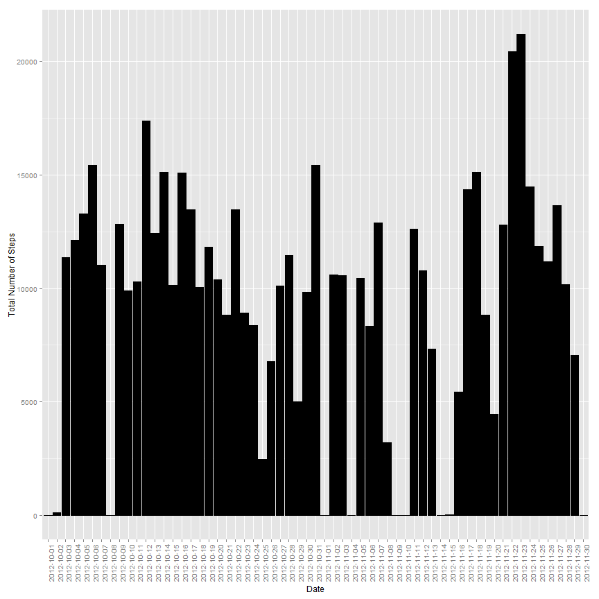
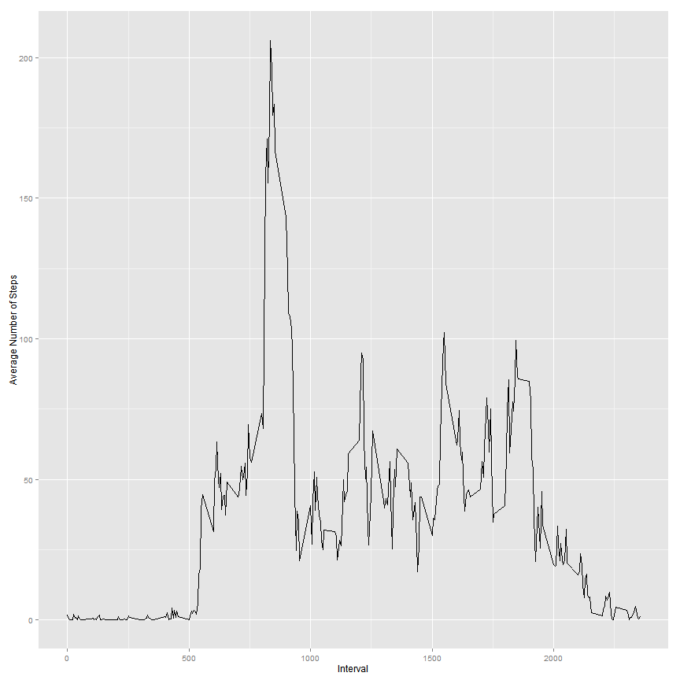
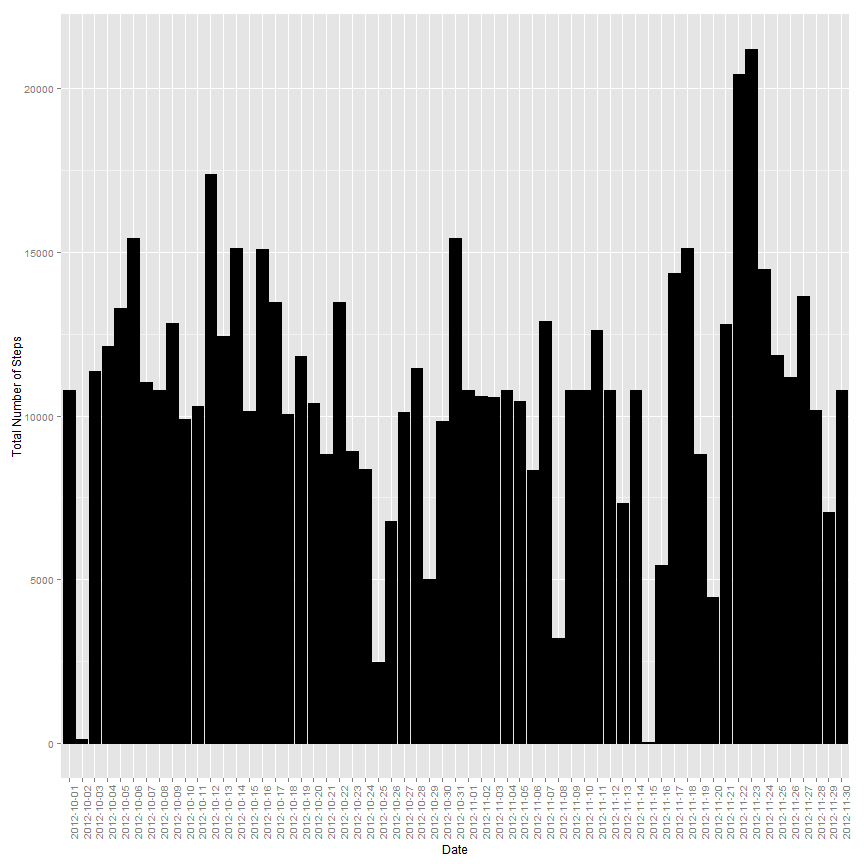
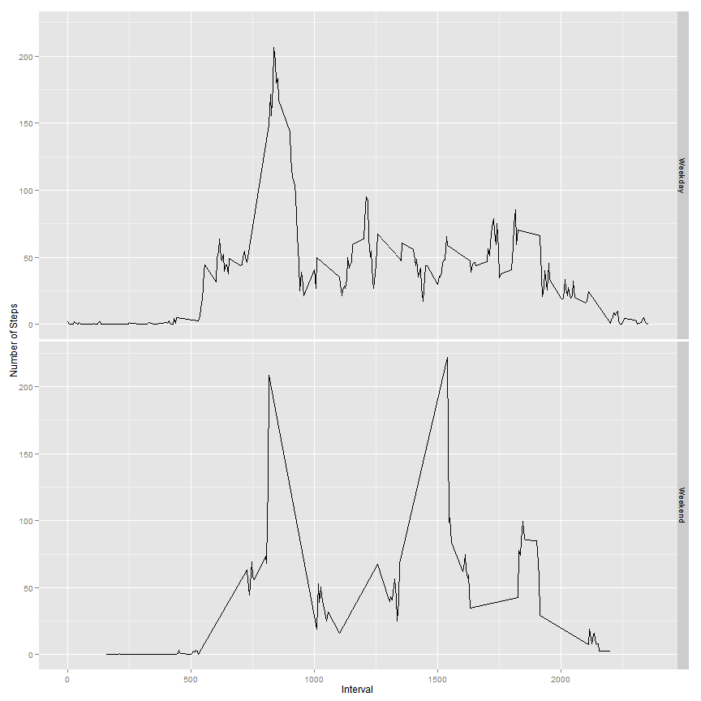

# Activity Monitoring Dataset Analysis
========================================================

## Part 1: Download and load the dataset 


```r
library(ggplot2)   
library(plyr)      
```

```
## Warning: package 'plyr' was built under R version 3.0.3
```

```r
file.link = 
    c("http://d396qusza40orc.cloudfront.net/repdata%2Fdata%2Factivity.zip");
download.file( file.link, destfile = "ActivityMonitoringData.zip" )
download.date <- date()

download.session.info <- sessionInfo()

unzip("ActivityMonitoringData.zip")
amd = read.csv("activity.csv")
```

## Part 2: Mean total number of steps per day


```r
# Calculate and report the mean and median total number of steps taken per day
mtnspd = ddply(amd, .(date), summarize, 
                   total = sum(steps, na.rm = TRUE),
                   mean = mean(steps, na.rm = TRUE),
                   median = median(steps, na.rm = TRUE))

mean = mean(mtnspd$total, na.rm = TRUE)
median = median(mtnspd$total, na.rm = TRUE)

# A histogram of the total number of steps taken each day
ggplot(mtnspd, aes( x = date, y = total)) + 
    geom_bar(stat = "identity", fill = "black", colour = "black") + 
    xlab("Date") + 
    ylab("Total Number of Steps") + 
    theme(axis.text.x = element_text(angle = 90))
```

 

The mean number of steps taken per day is ``9354.2295`` and the median number of steps taken per day is ``10395``.


## Part 3: Average daily activity pattern


```r
interval = ddply(amd, .(interval), summarize, 
                   mean = mean(steps, na.rm = TRUE))

# Make a time series plot of the 5-minute interval (x-axis) and the average number of steps taken, 
# averaged across all days (y-axis)
ggplot( interval, aes(x=interval, y=mean)) + geom_line() +
    xlab( "Interval") + 
    ylab( "Average Number of Steps")
```

 

```r
# Find 5-minute interval that contains the maximum number of steps
intervalmax = interval$interval[which.max(interval$mean)]     
```

The interval with the maximum number of steps is interval ``835``.


## Part 4: Imputing missing values


```r
# Calculate and report the total number of missing values in the dataset
mv.steps = sum(is.na(amd$steps))
mv.date = sum(is.na(amd$date))
mv.interval = sum(is.na(amd$interval))

# Filling in all of the missing values in the dataset using the mean for that 5-minute interval 
library(Hmisc)
```

```
## Warning: package 'Hmisc' was built under R version 3.0.3
```

```
## Loading required package: grid
## Loading required package: lattice
```

```
## Warning: package 'lattice' was built under R version 3.0.3
```

```
## Loading required package: survival
## Loading required package: splines
## Loading required package: Formula
## 
## Attaching package: 'Hmisc'
## 
## The following objects are masked from 'package:plyr':
## 
##     is.discrete, summarize
## 
## The following objects are masked from 'package:base':
## 
##     format.pval, round.POSIXt, trunc.POSIXt, units
```

```r
imputed <- ddply(amd, "interval", mutate, imputed.value = impute(steps, mean))
detach("package:Hmisc", unload=TRUE)
# Create a new dataset that is equal to the original dataset but with the missing data filled in
amd.filled <- imputed[,-1] 
names(amd.filled)[3] <- "steps"

# Calculate and report the mean and median total number of steps taken per day
mtnspd2 <- ddply(amd.filled, .(date), summarize, 
                   total = sum(steps, na.rm = TRUE))
mean2 <- mean(mtnspd2$total, na.rm = TRUE)
median2 <- median(mtnspd2$total, na.rm = TRUE)

# A histogram of the total number of steps taken each day
ggplot(mtnspd2, aes( x = date, y = total)) + 
    geom_bar(stat = "identity", fill = "black", colour = "black") + 
    xlab("Date") + 
    ylab("Total Number of Steps") + 
    theme(axis.text.x = element_text(angle = 90))
```

 

The new average value for the number of steps per day is ``1.0766 &times; 10<sup>4</sup>`` as compared to ``9354.2295``  before imputation.


The new median value for the number of steps per day is ``1.0766 &times; 10<sup>4</sup>`` as compared to ``10395``  before imputation.


## Part 5: Differences in activity patterns between weekdays and weekends


```r
# Create a new factor variable in the dataset with two levels weekday and weekend indicating whether a given date is a weekday or weekend day.
amd.filled$weekday <- weekdays(as.Date(amd$date,"%Y-%m-%d"))
weekend <- c("Saturday", "Sunday")
amd.filled$type <- ifelse(amd.filled$weekday %in% weekend,"Weekend", "Weekday")

step.type <- ddply(amd.filled, .(type, interval), summarize, 
                   mean = mean(steps, na.rm = TRUE))
# Make a time series plot interval (x-axis) and the average number of steps, averaged across all weekday days or weekend days (y-axis)
ggplot(step.type, aes(x=interval, y=mean)) + geom_line() +
    facet_grid(type ~ .) + ylab("Number of Steps") +
    xlab("Interval") 
```

 

The most distinct difference between weekdays and weekends is the additional peak of steps at the interval of 1500 during the weekends.
